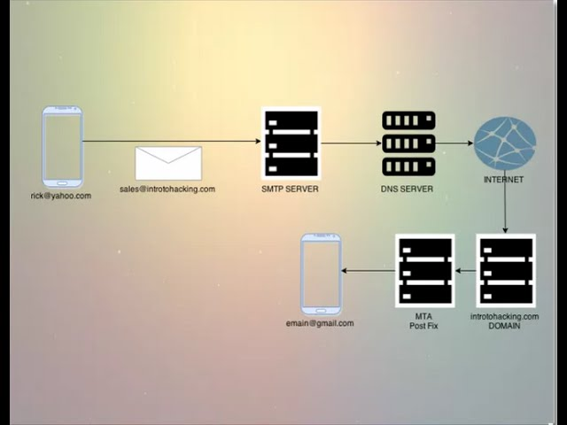

# Secure Email Forwarding

## Here are several compelling reasons to utilize this service:

1. Safeguard your primary email address from spam by easily deactivating or deleting aliases that attract unwanted emails.
2. Pinpoint the source of data sales by employing distinct email addresses for different websites.
3. Shield your identity in case of a data breach by complicating hackers' attempts to correlate your accounts.
4. Foil inbox prying by encrypting all incoming emails with GPG/OpenPGP encryption.
5. Modify email forwarding destinations without the hassle of updating your email address for each site separately.
6. Respond to forwarded emails anonymously, preserving the confidentiality of your actual email address.

## Software Requirements
- Postfix (3.0.0+) (plus postfix-mysql for database queries and postfix-pcre)
- PHP (8.2+) and the php-mailparse extension, the php-gnupg extension if you plan to encrypt forwarded emails, the - php-imagick extension for generating 2FA QR codes
- Port 25 unblocked and open
- Redis (7.x+) for throttling and queues
- FQDN as hostname e.g. mail.anonaddy.me
- MariaDB / MySQL
- Nginx
- Rspamd
- DNS records - MX, SPF, DKIM, DMARC
- Reverse DNS
- SSL/TLS Encryption - you can install a free certificate from Let’s Encrypt.
- You should have a fresh 22.04 Ubuntu server with Fail2ban, a Firewall (e.g UFW), and make sure that ports 25, 22 (or whatever your SSH port is if you've changed it) 443 and 80 are open.

-https://www.youtube.com/watch?v=mRUGEygkDEQ